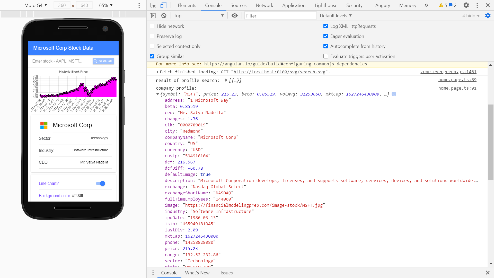

# :zap: Ionic Angular Charts

* App to chart historic stock prices from the [FMP financial data API](https://financialmodelingprep.com/developer/docs) using the [Ionic framework](https://ionicframework.com/docs).
* Includes tutorial from [Simon Grimm at Devdactic](https://www.youtube.com/channel/UCZZPgUIorPao48a1tBYSDgg) - see [:clap: Inspiration](#clap-inspiration) below. Changes added to show more API data using another http get request
* **Note:** to open web links in a new window use: _ctrl+click on link_


## :page_facing_up: Table of contents

* [:zap: Ionic Angular Charts](#zap-ionic-angular-charts)
  * [:page_facing_up: Table of contents](#page_facing_up-table-of-contents)
  * [:books: General info](#books-general-info)
  * [:camera: Screenshots](#camera-screenshots)
  * [:signal_strength: Technologies](#signal_strength-technologies)
  * [:floppy_disk: Setup](#floppy_disk-setup)
  * [:computer: Code Examples](#computer-code-examples)
  * [:cool: Features](#cool-features)
  * [:clipboard: Status & To-do list](#clipboard-status--to-do-list)
  * [:clap: Inspiration](#clap-inspiration)
  * [:file_folder: License](#file_folder-license)
  * [:envelope: Contact](#envelope-contact)

## :books: General info

* Tutorial code changed to show example financial data on initialisation and clear the stock entry field (TSLA is shown) as I preferred this to initially seeing an empty graph.
* Tutorial code changed to avoid use of string literals - `const history = res['historical'];` caused a typescript error.
* Note: I had to reverse both x and y array values (date & stock price) so data would not display backwards.
* **Important note on versions**: This only works with ng2-charts v2.4.2, chart.js v2.9.4 and chartjs-plugin-zoom v0.7.7. Updating to the latest versions of these chart-based dependencies will mean this app does NOT work without major reconfiguration.
* [FMP financial data API](https://financialmodelingprep.com/developer/docs) free plan limited to 250 requests a day.

## :camera: Screenshots



## :signal_strength: Technologies

* [Ionic v6](https://ionicframework.com/) framework.
* [Ionic/angular v6](https://ionicframework.com/)
* [Angular framework v13](https://angular.io/)
* [rxjs library v7](https://angular.io/guide/rx-library) reactive prrogramming.
* [ng2-charts v2](https://valor-software.com/ng2-charts/) line & bar charts.
* [chart.js v2](https://www.chartjs.org/) datasets.
* [chartjs-plugin-zoom v0.7.7](https://github.com/chartjs/chartjs-plugin-zoom)
* [FMP financial data API](https://financialmodelingprep.com/developer/docs)

## :floppy_disk: Setup

* Install dependencies using `npm i`
* API key: sign up with [FMP financial data API](https://financialmodelingprep.com) to get an API key.
* To start the server on _localhost://8100_ type: 'ionic serve -o'
* Run `npm run build` to build the project. The build artifacts will be stored in the `dist/` directory. Use the `--prod` flag for a production build.

## :computer: Code Examples

* function to get data from API. Only stock variable is defined by user.

```typescript
getData() {
  this.http
    .get(`
      https://financialmodelingprep.com/api/v3/historical-price-full/
      ${this.stock}?to=2022-02-02&from=2017-02-02`).subscribe(res => {
        const history = res['historical'];

        this.chartLabels = [];
        this.chartData[0].data = [];

        for (const entry of history) {
          this.chartLabels.push(entry.date);
          this.chartData[0].data.push(entry.close);
        }
      });
}
```

## :cool: Features

* ng2-charts has 10 types of charts: line, bar, doughnut, radar, pie, polarArea, bubble, scatter, dynamic & financial. In this app the user can choose between line (default) and bar charts.

## :clipboard: Status & To-do list

* Status: Working.
* To-do: develop into a more complex app. Add inputs for more variables such as start and end dates for history. Add ESLint.

## :clap: Inspiration

* [Simon Grimm Devdactic Youtube video 'How to Build Ionic 4 Apps with Chart.js'](https://www.youtube.com/watch?v=8sd99RJeYSk)
* [Written version of tutorial: How to Build Ionic 4 Apps with Chart.js](https://devdactic.com/ionic-4-chartjs/)
* [Github repo: antoinevulcain/Financial-Modeling-Prep-API](https://github.com/antoinevulcain/Financial-Modeling-Prep-API)
* [JavaScript Array reverse() Method](https://www.w3schools.com/jsref/jsref_reverse.asp)

## :file_folder: License

* This project is licensed under the terms of the MIT license.

## :envelope: Contact

* Repo created by [ABateman](https://github.com/AndrewJBateman), email: gomezbateman@yahoo.com
